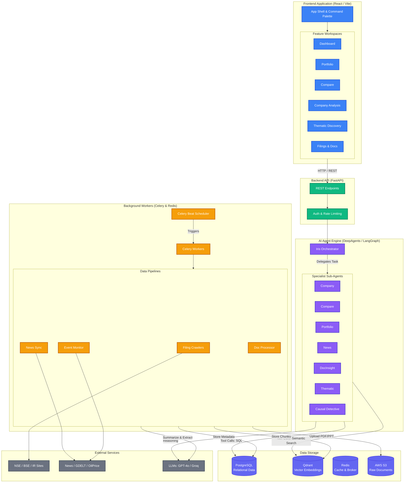
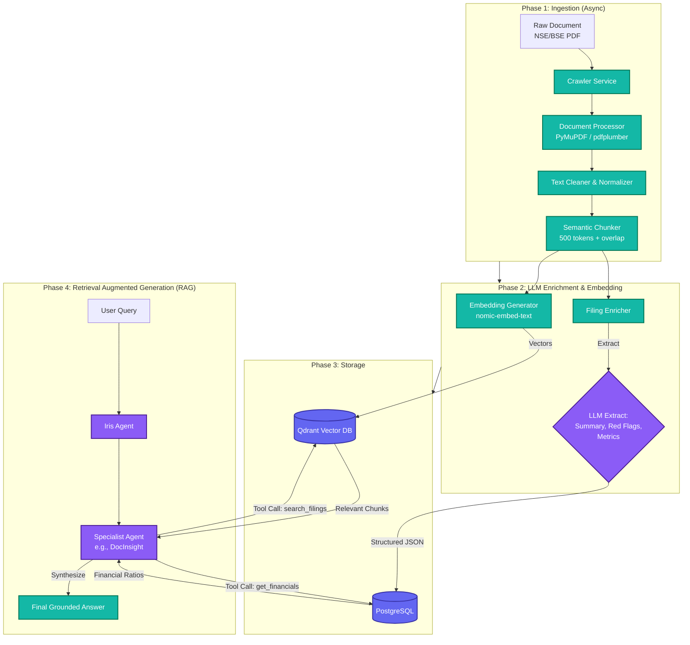

# Full System Architecture Diagrams

You can copy the code blocks below and paste them directly into the [Mermaid Live Editor](https://mermaid.live/) (or any markdown viewer that supports Mermaid, like GitHub or Notion) to render the full system diagrams.

## 1. High-Level Full System Architecture (Frontend + Backend + Data)

This diagram shows the complete bird's-eye view of the system, from the React frontend down to the external APIs and data storage.

---

## 2. Detailed Data Flow: ETL & RAG Pipeline

This diagram zooms in on exactly how a raw document from the internet turns into an AI answer on the frontend.

---

## 3. Causal Intelligence Engine Flow

This diagram specifically highlights how the "Hidden Patterns" engine works.

```mermaid
graph LR
    %% Styling
    classDef external fill:#6b7280,stroke:#374151,stroke-width:2px,color:#fff;
    classDef process fill:#f59e0b,stroke:#b45309,stroke-width:2px,color:#fff;
    classDef db fill:#6366f1,stroke:#3730a3,stroke-width:2px,color:#fff;
    classDef insight fill:#10b981,stroke:#047857,stroke-width:2px,color:#fff;

    E1[GDELT Cloud]:::external --> |Geopolitical Events| M1[Event Monitor Task]:::process
    E2[OilPrice / Commodity API]:::external --> |Price Spikes| M2[Commodity Sync Task]:::process
    E3[News APIs]:::external --> |Classified News| M3[News Classifier Task]:::process

    M1 --> DB[(PostgreSQL)]:::db
    M2 --> DB
    M3 --> DB

    DB --> CC{Causal Chain Engine}:::process
    
    CC --> |Trigger: Middle East Conflict| H1[Hop 1: Oil Prices Surge]:::process
    H1 --> |Hop 2: Input Cost Increase| H2[Hop 2: Aviation Sector]:::process
    H2 --> |Hop 3: Margin Pressure| H3[Hop 3: Airline Stocks]:::process

    H3 --> I[Portfolio Alerts & Hidden Pattern UI]:::insight
```

