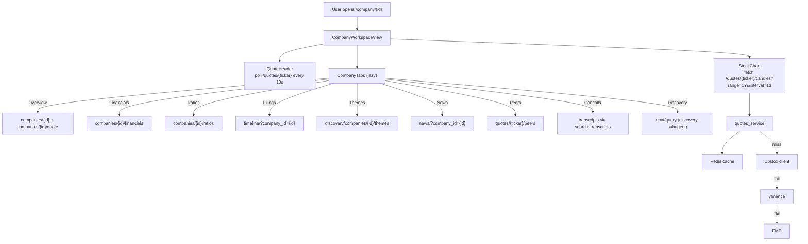

# Round 2 Plan — Broker-Grade Platform

## Goal

Take the platform from "research-paper-style web app with insight pipeline" to a **broker-app-grade product**, in two phases.

- **P1** ships the user-visible critical path (auth, personalised home, broker-style stock page, fix broken endpoints, cache foundation).
- **P2** hardens infrastructure and adds streaming / MCP / async / ETL re-evaluation.

This merges the comprehensive scope from `plans/NEXT_ROUND_PROMPT.md` with the pragmatic decisions and audit findings from the Cursor plan.

---

## Locked decisions

Override any of these by saying so before we start building.

| # | Decision | Choice | Rationale |
|---|---|---|---|
| **D1** | ETL orchestrator | **Stay on Celery + SQS + Redis (OSS).** Document migration trigger. | At ~5,000 listed companies × ~50 docs/yr ≈ 250k docs/year, the bottleneck is LLM cost, not orchestration. MWAA (~$400/mo), Databricks (~$300+/mo), Prefect Cloud freemium all add ops cost without solving the actual constraint. Celery tasks are already idempotent and pure → port later when needed. **Trigger to revisit:** sustained > 1k jobs/hour OR pipeline lineage becomes a debug bottleneck. |
| **D2** | Auth | **Roll-our-own FastAPI + argon2id + JWT (access + refresh, refresh rotation in Redis).** | ~1 day to ship, no vendor lock-in, free. argon2id over bcrypt per OWASP 2024. Migrate to Auth0/Clerk only after 1k MAU or enterprise SSO ask. |
| **D3** | Stock chart data | **Tiered: Upstox (logged-in) → yfinance (guests / fallback) → FMP (last resort).** Cache aggressively. | Upstox is best NSE/BSE source but requires user OAuth. yfinance is free, no key, acceptable for EOD + intraday. FMP is paid backup. Quote LTP cached 15s; candles cached by range (1D=60s, 1Y=24h). |
| **D4** | Charting library | **TradingView Lightweight Charts (Apache 2.0).** | Best broker-app feel, ~50KB, free, native red/green candles, native volume pane. Plotly stays for visualization service PNGs; Recharts stays for sentiment chart. |
| **D5** | Real-time price | **P1: 10s polling. P2: SSE.** | Polling ships without backend infra changes. SSE upgrade is one route in P2. |
| **D6** | Frontend state / server cache | **TanStack Query (React Query v5).** | Caching, retries, pagination, optimistic updates, stale-while-revalidate — dramatic UX win. Required for W2 / W5 / W6. |
| **D7** | Chat streaming | **P2 only.** | Per scope. P1 keeps existing thinking-then-swap pattern. |
| **D8** | MCP exposure | **P2 only.** | No external clients consuming today. Plan the surface (theme search, asymmetric feed, company facts, portfolio metrics) but don't build until needed. |
| **D9** | Deployment | **Docker Compose on existing VPS.** | Already working. Migrate to ECS/Cloud Run when traffic justifies. |
| **D10** | New SaaS spend ceiling P1 | **~$50/mo.** | Upstox free, yfinance free, OpenAI/Groq moderate use, no new managed service in P1. |
| **D11** | Async / parallel tool calls in agents | **P1 light: parallel `asyncio.gather` only inside subagents that already have independent reads** (financials + ratios + news for one company). | One easy latency win without restructuring the agent graph. Full async-route conversion deferred to P2. |

---

## Confirmed gaps (file-level evidence)

### Auth

- [User.password_hash](backend-ai/src/db/models.py#L267) exists but is unused; no signup/login routes; no `get_current_user` dep.
- All `user_id`-keyed routes are unauthenticated: [chat/routes.py](backend-ai/src/domains/chat/routes.py), [domains/users/routes.py](backend-ai/src/domains/users/routes.py), portfolio, watchlists, alerts, screens, broker.
- Frontend uses a UUID stored in localStorage as identity ([ProfileView.tsx:~115](frontend/src/features/profile/ProfileView.tsx)); no login screen.

### Personalisation surfaces

- `DiscoveryView` doesn't call `fetchWatchlists` / `fetchPortfolios` ([DiscoveryView.tsx:72-110](frontend/src/features/discovery/DiscoveryView.tsx)).
- `createWatchlist`, `addToWatchlist`, `addHolding` defined in [shared/api/platform.ts](frontend/src/shared/api/platform.ts) but **never imported** by any view.
- No global omnisearch in `SidebarShell`; no Home dashboard page.

### Broker-app stock page

- No OHLC chart, no range toggles, no volume bars, no peer grid, no in-page news ([CompanyWorkspaceView.tsx](frontend/src/features/company/CompanyWorkspaceView.tsx)).
- Backend has provider clients (FMP, Upstox, Kite, yfinance) for OHLC but **no `/quotes/{ticker}/candles` route** in [companies/routes.py](backend-ai/src/domains/companies/routes.py).

### Frontend ↔ backend mismatches

- `fetchHoldingsCount` → `/upstox/portfolio/holdings` 404s; backend exposes `/broker/...` and `/portfolios/{id}/holdings`.
- `newsdata/market/headlines`, `newsdata/sentiment/{symbol}` referenced in [external.ts](frontend/src/shared/api/external.ts), unimplemented backend-side.
- `fetchInsightDetail` and `fetchInsightMetrics` in [platform.ts](frontend/src/shared/api/platform.ts) — never imported.

### ETL coverage (additions to Cursor audit)

- BSE corporate-announcement crawler — needs verification; current code emphasises NSE.
- Concall transcript audio ingestion — not present (only text segments via `transcript_ingest`).
- Insider / promoter trading disclosures — no dedicated crawler.
- Self-discovery for new IPOs / new listings — `sync_stock_universe` exists; verify it actually picks up newly listed names and chains downstream parsing.
- DLQ + alert-on-stuck-pipeline — `etl_runs` table tracks status, but no monitor task/alert exists.

### Observability

- `structlog` partially adopted; some new services log via stdlib `logging`. Standardise.
- No `/health` or `/ready` endpoints.
- No Prometheus / OTel counters anywhere.

---

## P1 phased plan

Effort estimates assume one engineer. Total P1 ≈ 3–4 weeks.

---

### W1 · Auth & Profile (~5 days)

**Backend — new files**

```
src/domains/auth/__init__.py
src/domains/auth/routes.py        # /auth/signup /login /refresh /logout /forgot-password /reset-password /verify-email
src/domains/auth/service.py       # signup, login, refresh, password reset, email-verify
src/domains/auth/security.py      # argon2id hash/verify, JWT encode/decode, refresh rotation, blacklist
src/domains/auth/dependencies.py  # get_current_user FastAPI dep + optional_user variant
src/domains/auth/email.py         # SES / SMTP sender (stubbed for dev)
src/domains/auth/schemas.py       # Pydantic Signup / Login / TokenPair / ResetRequest etc.
```

**Backend — modify**

- [src/db/models.py](backend-ai/src/db/models.py): extend `User` with `email_verified_at`, `last_login_at`, `avatar_url`, `theme_preference`, `default_chart_range`, `sectors_of_interest` (`ARRAY(String)`).
- [src/app/routers.py](backend-ai/src/app/routers.py): register `auth_router`.
- Apply `Depends(get_current_user)` on every non-public route: chat, portfolio, watchlists, alerts, screens, broker, users, uploads. Keep `/health`, `/ready`, `/companies/*` (read-only), `/discovery/*` (read-only), `/timeline/` (anonymous-friendly), and `/auth/*` public.
- New Alembic migration `c1d2e3f4_auth_user_extensions.py`.
- Add to `requirements.txt`: `passlib[argon2]>=1.7.4`, `python-jose[cryptography]>=3.3.0`.
- Rate-limit `POST /auth/login` and `POST /auth/forgot-password` to 5 req/min/IP via `slowapi` (already in repo? if not, add).

**Frontend — new files**

```
src/features/auth/SignUpView.tsx
src/features/auth/LoginView.tsx
src/features/auth/ForgotPasswordView.tsx
src/features/auth/ResetPasswordView.tsx
src/features/auth/EmailVerifyView.tsx
src/shared/api/auth.ts                  # signup / login / refresh / logout / forgot / reset
src/shared/api/client.ts                # fetch wrapper: auto-attaches access token, 401 → silent refresh
src/app/state/AuthContext.tsx           # provides currentUser, login(), logout()
src/app/state/RequireAuth.tsx           # route guard
```

**Frontend — modify**

- `App.tsx` / AppShell: wrap routes in `<AuthProvider>` and gate non-public routes with `<RequireAuth>`. Redirect to `/login` on 401.
- [ProfileView.tsx](frontend/src/features/profile/ProfileView.tsx): use `useAuth()` instead of UUID-in-localStorage.

**Verification (W1)**

- pytest: signup → email verify → login → access token works → expire → refresh works → logout → blacklist applied → token rejected.
- Manual: forgot-password emits a token (logged in dev), reset-password accepts it.
- Auth headers attached to every API call from FE.
- Rate-limit returns 429 after 5 rapid login attempts.

---

### W2 · Watchlist + Portfolio Surfacing (~3 days)

**Backend — new**

```
src/domains/home/__init__.py
src/domains/home/routes.py     # GET /home/personalized → { watchlist, holdings, asymmetric_feed_top, timeline_recent, suggestions }
src/domains/home/service.py    # 60-second Redis cache keyed by user_id
```

**Backend — verify (already exists)**

- `GET /watchlists/?user_id=` and `POST /watchlists/{id}/companies` — confirm routes match what FE expects.
- `GET /portfolios/?user_id=` and `GET /portfolios/{id}/holdings`.

**Frontend — new**

```
src/features/home/HomeView.tsx                # default landing page
src/features/home/WatchlistRail.tsx
src/features/home/HoldingsRail.tsx
src/features/home/TrendingThemesRail.tsx      # uses /discovery/asymmetric
src/features/home/RecentTimelineRail.tsx      # uses /timeline/
src/components/OmniSearch.tsx                  # debounced; default results = watchlist + holdings when empty
```

**Frontend — modify**

- [SidebarShell](frontend/src/components/SidebarShell.tsx): mount `<OmniSearch />` in the header.
- [DiscoveryView.tsx](frontend/src/features/discovery/DiscoveryView.tsx): fetch + show user's watchlist + portfolios at top of the panel.
- Wire the unused [createWatchlist, addToWatchlist, addHolding](frontend/src/shared/api/platform.ts) into a new `WatchlistManager.tsx` and `PortfolioManager.tsx` (modal flows from the home page).

**Verification (W2)**

- Logged-in user lands on `/home`, sees their watchlist + holdings rails populated.
- Empty omnisearch shows watchlist + holdings as default suggestions.
- Add a company to watchlist via the UI → it appears in the rail without page reload (TanStack Query cache invalidation).

---

### W3 · Broker-App Company Workspace (~6 days)

This is the visual centerpiece.

**Backend — new**

```
src/domains/quotes/__init__.py
src/domains/quotes/routes.py            # GET /quotes/{ticker}, /quotes/{ticker}/candles, /quotes/{ticker}/peers
src/domains/quotes/service.py           # tiered provider Upstox → yfinance → FMP, Redis cache
src/services/market_data/historical_service.py    # candles aggregator
```

**Endpoints**

- `GET /quotes/{ticker}` → `{ ltp, day_high, day_low, open, prev_close, change_abs, change_pct, volume, timestamp, source }`. Cache 15 sec.
- `GET /quotes/{ticker}/candles?range=1D|1W|1M|6M|1Y|5Y|MAX&interval=1m|5m|15m|1h|1d` → `{ ohlcv: [{ t, o, h, l, c, v }, …], source }`. Cache by (ticker, range, interval): 1D=60s, 1W=5min, 1M=1h, 1Y/5Y=24h.
- `GET /quotes/{ticker}/peers` → top-N companies sharing sector/industry, sorted by market cap.

**Backend — modify**

- `requirements.txt`: add `yfinance>=0.2.40`.
- [src/app/routers.py](backend-ai/src/app/routers.py): register `quotes_router`.

**Frontend — new**

```
src/features/company/StockChart.tsx               # TradingView Lightweight Charts wrapper
src/features/company/QuoteHeader.tsx              # LTP + change + day range + OHLC strip + 10s polling
src/features/company/RangeToggle.tsx              # 1D / 1W / 1M / 6M / 1Y / 5Y / MAX
src/features/company/ChartModeToggle.tsx          # candle | line
src/features/company/CompanyTabs.tsx              # Overview / Financials / Ratios / Filings / Themes / News / Peers / Concalls / Discovery
src/features/company/CompanyOverviewTab.tsx
src/features/company/CompanyFinancialsTab.tsx
src/features/company/CompanyRatiosTab.tsx
src/features/company/CompanyFilingsTab.tsx        # uses /timeline/?company_id=
src/features/company/CompanyThemesTab.tsx         # /discovery/companies/{id}/themes; "Asymmetric" badge for is_asymmetric
src/features/company/CompanyNewsTab.tsx
src/features/company/CompanyPeersTab.tsx
src/features/company/CompanyDiscoveryTab.tsx      # surfaces find_second_order_effects results via Minerva
src/features/company/CompanyConcallsTab.tsx
src/features/company/AskMinervaFAB.tsx               # floating CTA, pre-fills chat with company_id context
src/features/company/BrokerActions.tsx            # Buy/Sell deep-links: kite.zerodha.com/?symbol=NSE:{ticker}
```

**Frontend — modify**

- [CompanyWorkspaceView.tsx](frontend/src/features/company/CompanyWorkspaceView.tsx): replace existing layout with broker-app shell composed of the above components.
- `package.json`: add `lightweight-charts: ^4.1.0`.

**Color rule for chart**

- Line/area fill green when last close > prev close, red otherwise; gradient alpha 0.2 fading to 0.0.
- Candles use the library's native `upColor`/`downColor`.

**Verification (W3)**

- Open Reliance → see live LTP refreshing every 10s, 1Y candlestick coloured by daily change.
- Switch range to 1M → re-fetch within 600ms cold, 80ms warm.
- Switch to line mode → smooth transition; gradient fill colour reflects direction.
- Click a peer in the Peers tab → navigates to that company's workspace.
- Click "Ask Minerva" FAB → chat opens with `[Context: company_id=…]` pre-filled.

---

### W8 · Fix Broken Endpoints (~1 day)

**Backend**

- Add `/upstox/portfolio/holdings` thin proxy that delegates to existing broker-domain logic (or change FE caller to `/portfolios/{id}/holdings` — pick whichever is cleaner; recommend FE change since `/upstox/...` couples to one broker).
- Add `/newsdata/market/headlines` and `/newsdata/sentiment/{symbol}` to the news router using the existing `NewsdataIO` provider in `src/integrations/market_data/providers/`.

**Frontend**

- Wire `fetchInsightDetail` and `fetchInsightMetrics` from [platform.ts](frontend/src/shared/api/platform.ts) into `DiscoveryView` (insight detail modal) and a new `InsightMetricsPanel`.
- Update `fetchHoldingsCount` to call `/portfolios/{id}/holdings` (or whichever path is finalised above).

**Verification (W8)**

- `curl /upstox/portfolio/holdings?...` returns 200 with holdings.
- `curl /newsdata/market/headlines` returns recent headlines.
- DiscoveryView shows insight detail modal on click.

---

### W5 (subset) · TanStack Query Foundation (~3 days)

**Frontend**

- `package.json`: add `@tanstack/react-query: ^5.x` and `@tanstack/react-query-devtools`.
- New `src/app/state/QueryProvider.tsx` with `QueryClient` defaults: `staleTime: 60_000`, `cacheTime: 300_000`, retry 1.
- Wrap `App.tsx` in `<QueryClientProvider>`.
- Convert critical fetches (in `HomeView`, `CompanyWorkspaceView`, `DiscoveryView`, `PortfolioView`) from `useEffect + useState` to `useQuery`.
- Defer remaining views to P2.

**Verification (W5)**

- React Query Devtools shows cache hits on revisit.
- Navigating Home → Reliance → back to Home renders instantly from cache.

---

### W6 (subset) · Redis Caching + JWT Blacklist (~2 days)

**Backend**

- [src/services/cache_service.py](backend-ai/src/services/cache_service.py): extend with helpers
  - `get_user_profile(user_id)` — 15-min TTL, key `user:{user_id}:profile`. Invalidate on user PATCH.
  - `get_quote(ticker)` — 15s TTL, key `quote:{ticker}`.
  - `get_candles(ticker, range, interval)` — TTL by range as in W3.
  - `get_asymmetric_feed(theme, sector)` — 10-min TTL, key `discovery:asymmetric:{theme}:{sector}`.
- `src/domains/auth/security.py` — JWT blacklist on logout: `SET blacklist:{jti} 1 EX={remaining_ttl}`.
- `get_current_user` checks blacklist before accepting a token.
- `src/domains/users/service.py` — invalidate `user:{user_id}:profile` cache on profile update.

**Verification (W6)**

- Hit `/quotes/RELIANCE` twice in 10s → second response < 20 ms (cache hit).
- Logout → reuse old access token → 401.
- PATCH user profile → next read returns updated value (cache invalidated).

---

### Observability bolt-on (woven through W1–W6, ~1 day)

- New `src/observability.py`: configure structlog + a `request_id` middleware that injects `request_id` into every log line.
- New `src/domains/health/routes.py`: `GET /health` (200 if alive), `GET /ready` (200 if Postgres + Redis + Qdrant pingable).
- Add `prometheus-client` and a `/metrics` endpoint.
- Counters: `agent_invocations_total`, `tool_calls_total{tool_name}`, `cache_hits_total{cache_name}`, `cache_misses_total{cache_name}`, `etl_run_status_total{pipeline,status}`, `alerts_fired_total`.

---

### ETL hardening (small additions, ~2 days, woven through P1)

The orchestrator stays Celery (D1). Just close the small gaps:

- **BSE crawler verify/add.** [src/etl/crawler_nse.py](backend-ai/src/etl/crawler_nse.py) covers NSE; if BSE is not similarly covered, add `crawler_bse.py` mirroring the NSE pattern.
- **DLQ monitor.** New Celery beat task `etl.monitor_stuck_runs` (every 30 min): query `etl_runs` for `status='running'` older than 2 hours → mark `failed` and write an `alert_events` row.
- **Self-discovery.** Verify [scripts/seed_db.py](backend-ai/scripts/seed_db.py) + `etl.sync_stock_universe` together pick up newly listed NSE/BSE companies; if not, schedule daily and chain `etl.crawl_nse(company_id)` for any company added in the last 24 h.

---

## P2 deferred items (with triggers)

| Item | Trigger to start |
|---|---|
| Streaming chat (SSE) | First user complaint about latency OR observed p95 chat-query > 4 s |
| MCP server (theme search, asymmetric feed, company facts, portfolio metrics) | First external integration request OR public launch of Minerva-as-API |
| Convert remaining sync routes to async | Load test shows event-loop saturation |
| Real-time SSE for prices | Watchlist polling load > 1k req/min |
| ETL platform migration (Airflow / Prefect / MWAA) | Sustained > 1k jobs/hour OR pipeline lineage becomes a debug bottleneck |
| Auth0 / Clerk migration | > 1,000 MAU OR enterprise SSO ask |
| Concall AUDIO ingestion + Whisper transcription | When a user explicitly requests audio coverage OR > 50 calls/day fail to find a text transcript |
| Insider / promoter trading dedicated crawler | Once W3 is live and demand for governance signals is observed |

---

## Non-functional requirements

- **Latency p95**
  - `/quotes/{ticker}`: < 250 ms cold, < 30 ms warm.
  - `/quotes/{ticker}/candles`: < 600 ms cold, < 80 ms warm.
  - `/discovery/asymmetric`: < 200 ms warm.
  - Chat query end-to-end (P1 polling): < 3 s.
- **Frontend**: cold-start TTI for `/company/{id}` < 1.5 s on 4G; skeleton-first.
- **Security**: argon2id (min cost params per OWASP 2024), HTTPS-only in prod, rate-limit auth (5 req/min/IP), no PII in logs, refresh token rotation, JWT blacklist on logout.
- **Observability**: every ETL run logged with `run_id`; every API response carries `X-Request-ID`; user-facing errors carry the same id.
- **Tests**: existing CI green (`PYTHONPATH=. pytest tests -q`); each new domain (`auth`, `quotes`, `home`) ships with at least one happy-path integration test.

---

## Verification plan summary

| Workstream | Verification |
|---|---|
| W1 | pytest: signup→verify→login→refresh→logout flow; FE: signup form → land on Home |
| W2 | Logged-in user sees personalised rails; empty omnisearch returns watchlist+holdings |
| W3 | Reliance: live LTP polling, range toggles, candle/line switch, color-coded direction, peers clickable, Ask Minerva pre-fills chat |
| W8 | curl smoke tests on all bug-fix endpoints; DiscoveryView modal opens |
| W5 | React Query Devtools shows cache hits on revisit |
| W6 | Second `/quotes/RELIANCE` < 20 ms; logout invalidates token |
| Observability | `/health` 200; `/metrics` exposes the 6 counters; logs are JSON with request_id |
| ETL | Trigger `etl.monitor_stuck_runs` manually with a stuck row → row marked failed + alert row written |

---

## Out-of-scope (P1)

- Real-time streaming chat (P2)
- MCP server (P2)
- Async route conversion beyond agent parallel-tool gather (P2)
- US market data
- iOS / Android native apps
- Order placement (only deep-link to broker)
- SAML / SSO
- Concall audio Whisper transcription
- WebSocket for real-time prices

---

## Diagrams

### Auth flow

```mermaid
sequenceDiagram
  participant FE as Frontend
  participant API as FastAPI
  participant DB as Postgres
  participant R as Redis

  FE->>API: POST /auth/signup {email, username, password}
  API->>DB: INSERT users (password_hash=argon2id(...))
  API->>API: send verify email (token, 24h)
  API-->>FE: 201 {user_id}

  FE->>API: GET /auth/verify-email?token=...
  API->>DB: UPDATE users SET email_verified_at=now()

  FE->>API: POST /auth/login {email, password}
  API->>DB: SELECT user WHERE email=?
  API->>API: argon2.verify(password)
  API->>R: SET refresh:{jti} user_id EX=30d
  API-->>FE: {access_token (15m), refresh_token (30d)}

  FE->>API: GET /portfolio (Bearer access_token)
  API->>R: GET blacklist:{jti}  # miss
  API->>API: decode JWT → user_id
  API->>R: GET user:{user_id}:profile  # cache hit
  API-->>FE: 200 {portfolios}

  Note over FE,API: access_token expires
  FE->>API: POST /auth/refresh {refresh_token}
  API->>R: GET refresh:{jti}  # found
  API->>R: DEL refresh:{old_jti} ; SET refresh:{new_jti}
  API-->>FE: {new access + new refresh}

  FE->>API: POST /auth/logout
  API->>R: SET blacklist:{access_jti} 1 EX=15m ; DEL refresh:{jti}
  API-->>FE: 204
```

### Company-page data flow



---

## Implementation order (recommended)

1. **W1 auth** (everything depends on it)
2. **W6 caching + JWT blacklist** (small; finishes auth properly)
3. **W3 quotes/candles backend + StockChart** (centerpiece — start chart wiring early)
4. **W3 remaining tabs** (parallel to W2 once chart shell is up)
5. **W2 home + omnisearch + watchlist/portfolio managers**
6. **W5 TanStack Query** (convert critical views as you build)
7. **W8 broken-endpoint cleanup** (drop-in fixes throughout)
8. **Observability bolt-on** (woven; add `/health` + `/metrics` early so we can monitor as we ship)

Total P1 ≈ 3–4 weeks for one engineer; ~2 weeks with two parallelising on FE/BE.

---

## Reuse-don't-rebuild reminders

- **Round 1 components stay**: theme tagger, discovery subagent, structured-output schema, governance flags, broker domain, alert evaluator, viz service.
- **Provider clients exist**: `Upstox`, `Kite`, `FMP`, `NewsdataIO` are already wrapped in [src/integrations/market_data/providers/](backend-ai/src/integrations/market_data/providers/). The new quotes service composes them; it doesn't reinvent them.
- **`cache_service` exists** in [src/services/cache_service.py](backend-ai/src/services/cache_service.py); extend, don't fork.
- **Subagents exist**: discovery / theme-explorer / company / etc. all already plumbed. Do NOT add new subagents in P1.

---

## Changelog vs Round 1

- Round 1 plan: built the agent + insight pipeline backbone (Discovery, governance flags, timeline summarizer, broker OAuth, alert evaluator, viz, structured schema). 15 work items shipped.
- Round 2 plan (this doc): puts a broker-grade UI on top, gates everything behind real auth, and hardens the speed/observability layer. P1 = 6 workstreams; P2 = 8 deferred items with explicit triggers.
