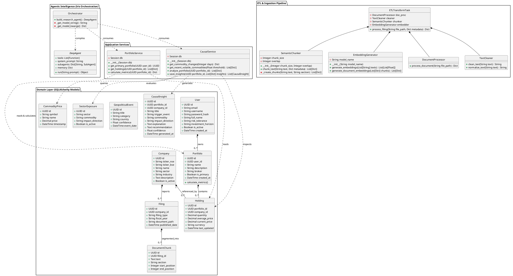
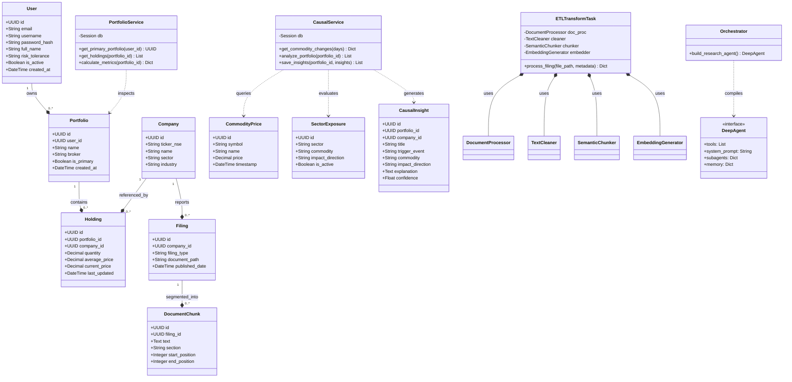

# EquityAI Class Diagrams (PlantUML & Mermaid)

This document contains full class definitions and relationship diagrams for **EquityAI**. The codes are designed to be copied directly into online rendering tools.

*   **PlantUML Renderers**: [PlantText](https://www.planttext.com/) or [PlantUML Online Server](https://www.plantuml.com/plantuml/).
*   **Mermaid Renderers**: [Mermaid Live Editor](https://mermaid.live/).

---

## 1. PlantUML Class Diagram Code

Copy the code block below and paste it into [PlantText](https://www.planttext.com/) to generate the diagrams.

---

## 2. Mermaid Class Diagram Code

Copy the code block below and paste it into the [Mermaid Live Editor](https://mermaid.live/) to render or compile dynamically.

---

## 3. Structural Design Patterns Employed

For the technical writing portion of your report, here are the architectural patterns demonstrated by the class design above:

1.  **Repository/Active Record - Domain Layer Separation**: SQLAlchemy models (`User`, `Portfolio`, `Holding`, `Company`) represent pure data mappings. Services (`PortfolioService`, `CausalService`) encapsulate the operations performed on these entities. This keeps logic testable and prevents database operations from cluttering the models.
2.  **Factory Pattern (Orchestrator and LLM models)**: `Orchestrator` uses settings-driven logic to dynamically instantiate model configurations (Ollama vs. OpenAI vs. Groq vs. DeepSeek) and build `DeepAgent` graph instances without locking the application to a single LLM vendor.
3.  **Pipeline Processing Pattern (ETL Transformation)**: `ETLTransformTask` orchestrates a sequential processing chain:
    $$\text{Raw Document} \xrightarrow{\text{DocumentProcessor}} \text{Raw Text} \xrightarrow{\text{TextCleaner}} \text{Normalized Text} \xrightarrow{\text{SemanticChunker}} \text{Chunks} \xrightarrow{\text{EmbeddingGenerator}} \text{Vectors}$$
4.  **Facade/Service Layer**: Direct database queries are restricted behind service wrappers (`CausalService`, `PortfolioService`) which expose simple Python dictionary interfaces to the agent tools and API controllers, preventing deep coupling between SQLAlchemy sessions and the LangGraph orchestrator.
