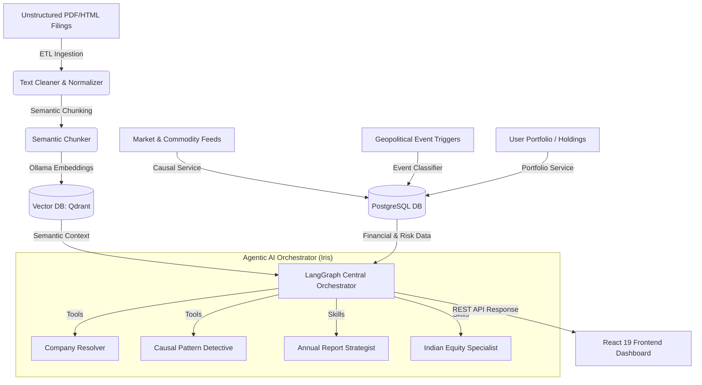

# EquityAI System Backbone & Code Snippets

This document contains the primary architectural blueprints, algorithms, and core code files of **EquityAI (AI-Native Equity Research Platform)**. It has been structured for copy-paste use in the final academic or technical project report.

---

## 1. System Architecture

The following block diagram represents the data flow, agentic orchestrator, and calculation pipeline of EquityAI:



---

## 2. Agentic AI Orchestrator

The orchestrator dynamically compiles specialist subagents, persistent memory backends, and domain skills using `deepagents` (a LangGraph-wrapped orchestration layer). This is the brain of the platform.

### Core File: `backend-ai/src/agents/orchestrator.py`
```python
"""Orchestrator: builds the main deep agent with sub-agents, skills, and
long-term memory for equity research."""

from __future__ import annotations
from typing import Any
from deepagents import create_deep_agent

from src.agents.memory import get_memory_config
from src.agents.prompts.orchestrator import ORCHESTRATOR_PROMPT
from src.agents.subagents import get_all_subagents
from src.agents.tools.company_resolver import resolve_company
from src.agents.tools.web_search import internet_search
from src.config import get_settings

_agent = None

def _get_model_string() -> str:
    """Map settings to the provider:model format expected by create_deep_agent."""
    s = get_settings()
    model = s.get_llm_model()

    if s.llm_provider == "ollama":
        return f"ollama:{model}"
    if s.llm_provider == "openai":
        return f"openai:{model}"
    if s.llm_provider == "groq":
        return f"openai:{model}"
    if s.llm_provider == "deepseek":
        return f"openai:{model}"
    return f"ollama:{model}"

def _get_model_kwargs() -> dict[str, Any]:
    """Return extra model configurations for custom endpoints (Groq, DeepSeek)."""
    s = get_settings()
    kwargs: dict[str, Any] = {}

    if s.llm_provider == "groq":
        from src.agents.middleware_groq import GroqChatOpenAI
        kwargs["model"] = GroqChatOpenAI(
            model=s.get_llm_model(),
            api_key=s.groq_api_key or "",
            base_url=s.groq_base_url,
            temperature=s.llm_temperature,
        )
    elif s.llm_provider == "deepseek":
        from src.agents.middleware_openai_compat import StrictOpenAICompatChatOpenAI
        kwargs["model"] = StrictOpenAICompatChatOpenAI(
            model=s.get_llm_model(),
            api_key=s.deepseek_api_key or "",
            base_url=s.deepseek_base_url,
            temperature=s.llm_temperature,
        )
    return kwargs

def build_research_agent():
    """Build and return the compiled orchestrator deep agent.
    
    Equipped with:
    - Long-term memory (/memories/ persists across sessions)
    - Progressive disclosure skills (Indian Equity, Portfolio Strategy)
    - Conversation checkpointer for state preservation
    """
    global _agent
    if _agent is not None:
        return _agent

    extra = _get_model_kwargs()
    model = extra.pop("model") if "model" in extra else _get_model_string()
    memory_cfg = get_memory_config()
    subagents = get_all_subagents()

    _agent = create_deep_agent(
        model=model,
        tools=[resolve_company, internet_search],
        system_prompt=ORCHESTRATOR_PROMPT,
        subagents=subagents,
        **memory_cfg,
    )
    return _agent
```

---

## 3. Quantitative Risk & Portfolio Mathematics

The portfolio service calculates risk-adjusted performance using standard investment theory models: CAPM, Beta estimation, Sharpe Ratio, and diversification using the **Herfindahl-Hirschman Index (HHI)**.

### Mathematical Formulation
1. **Herfindahl-Hirschman Index (HHI) for Sector Allocation**:
   $$\text{HHI} = \sum_{i=1}^{N} (w_i \times 100)^2$$
   where $w_i$ is the weight of sector $i$ in the portfolio (from 0 to 1). If a portfolio is fully concentrated in a single sector, $\text{HHI} = 10000$. The diversification score is mapped from 0 to 100:
   $$\text{Diversification Score} = \max\left(0, \min\left(100, 100 - \frac{\text{HHI}}{100}\right)\right)$$

2. **Capital Asset Pricing Model (CAPM) Expected Return**:
   $$E(R_p) = R_f + \beta_p \times (E(R_m) - R_f)$$
   Where $R_f$ is the Risk-Free Rate (7.0% for Indian Government Securities), $E(R_m)$ is the Expected Market Return (12.0% for Nifty 50), and $\beta_p$ is the weighted portfolio beta.

3. **Sharpe Ratio**:
   $$\text{Sharpe Ratio} = \frac{E(R_p) - R_f}{\sigma_p}$$
   where $\sigma_p$ is the portfolio volatility (modeled as $\sigma_{\text{market}} \times \beta_p$, where $\sigma_{\text{market}} = 15\%$).

### Core File: `backend-ai/src/services/portfolio_service.py`
```python
"""Portfolio service: Calculates HHI, CAPM Beta, Volatility, and Sharpe Ratio."""

from typing import Any, Dict, List, Optional
from uuid import UUID
from sqlalchemy.orm import Session
from src.db.models import Holding, Portfolio, Company

class PortfolioService:
    def __init__(self, db: Session):
        self.db = db

    def get_holdings(self, portfolio_id: UUID) -> List[Dict[str, Any]]:
        holdings = self.db.query(Holding).filter(Holding.portfolio_id == portfolio_id).all()
        result = []
        for h in holdings:
            result.append({
                "holding_id": str(h.id),
                "company_id": str(h.company_id),
                "quantity": float(h.quantity),
                "average_price": float(h.average_price) if h.average_price else None,
                "current_price": float(h.current_price) if h.current_price else None,
                "currency": h.currency,
                "value": float(h.quantity * (h.current_price or h.average_price or 0)) if h.quantity else 0,
            })
        return result

    def calculate_metrics(self, portfolio_id: UUID) -> Dict[str, Any]:
        holdings = self.get_holdings(portfolio_id)
        if not holdings:
            return {"portfolio_id": str(portfolio_id), "total_value_inr": 0, "diversification_score": 0}

        total_value = sum(h.get("value", 0) for h in holdings)
        sector_allocation = {}
        weighted_beta = 0.0
        
        for h in holdings:
            company = self.db.query(Company).filter(Company.id == UUID(h["company_id"])).first()
            weight = h.get("value", 0) / total_value if total_value > 0 else 0
            
            if company:
                sector = company.sector or "Unknown"
                sector_allocation[sector] = sector_allocation.get(sector, 0) + weight
                
                # Dynamic Beta heuristics representing market volatility sensitivity
                base_beta = 1.0
                if sector == "Technology": base_beta = 1.2
                elif sector == "Financials": base_beta = 1.1
                elif sector == "Healthcare": base_beta = 0.8
                elif sector == "Energy": base_beta = 1.3
                elif sector == "Consumer": base_beta = 0.9
                
                weighted_beta += (base_beta * weight)
            else:
                weighted_beta += (1.0 * weight)

        # Portfolio Volatility model (15% benchmark volatility)
        portfolio_volatility = 0.15 * weighted_beta
        risk_free_rate = 0.07  # 7% Indian G-Sec
        expected_market_return = 0.12  # 12% Expected return
        expected_portfolio_return = risk_free_rate + weighted_beta * (expected_market_return - risk_free_rate)
        
        sharpe_ratio = (expected_portfolio_return - risk_free_rate) / (portfolio_volatility if portfolio_volatility > 0 else 1)
        
        # Herfindahl-Hirschman Index (HHI) computation
        hhi = sum((w * 100)**2 for w in sector_allocation.values())
        diversification_score = max(0, min(100, 100 - (hhi / 100)))

        enriched_holdings = []
        for h in holdings:
            company = self.db.query(Company).filter(Company.id == UUID(h["company_id"])).first()
            val = h.get("value", 0)
            weight = val / total_value if total_value > 0 else 0
            avg_price = h.get("average_price") or 0
            curr_price = h.get("current_price") or avg_price or 0
            return_pct = ((curr_price - avg_price) / avg_price * 100) if avg_price > 0 else 0
            
            enriched_holdings.append({
                **h,
                "weight": weight * 100,
                "return_pct": return_pct,
                "company_name": company.name if company else "Unknown",
                "ticker_nse": company.ticker_nse if company else "Unknown",
                "sector": company.sector if company else "Unknown",
            })

        return {
            "portfolio_id": str(portfolio_id),
            "total_value_inr": total_value,
            "holdings_count": len(holdings),
            "portfolio_beta": round(weighted_beta, 2),
            "portfolio_volatility": round(portfolio_volatility, 3),
            "sharpe_ratio": round(sharpe_ratio, 2),
            "diversification_score": int(diversification_score),
            "sector_allocation": {k: round(v, 4) for k, v in sector_allocation.items()},
            "holdings": enriched_holdings,
        }
```

---

## 4. Causal Exposure & Geo-Intelligence Engine

The causal engine maps macro-geopolitical vectors and global commodity shocks directly to regional sectors and companies to expose secondary or tertiary market vulnerabilities.

### Core File: `backend-ai/src/services/causal_service.py`
```python
"""Causal intelligence service: Linkages between geopolitics, commodities, and sector exposures."""

import logging
from datetime import datetime, timedelta
from typing import Any
from uuid import UUID
from sqlalchemy.orm import Session
from src.db.models import (
    CausalInsight, CommodityPrice, Company, GeopoliticalEvent, Holding, Portfolio, SectorExposure
)

# Sector to Global Commodity Index Mapping
SECTOR_COMMODITY_MAP = {
    "Oil & Gas": ["WTI_USD", "BRENT_CRUDE_USD", "NATURAL_GAS_USD"],
    "Power": ["COAL_USD", "NATURAL_GAS_USD"],
    "Transportation": ["WTI_USD", "DIESEL_USD"],
    "Aviation": ["WTI_USD", "JET_FUEL_USD"],
    "Fertilizer": ["NATURAL_GAS_USD"],
    "Sugar": ["sugar_11"],
    "Jewellery": ["XAU"],
    "Metals & Mining": ["copper", "XAG"],
    "Automobile": ["WTI_USD"],
    "Chemicals": ["WTI_USD", "NATURAL_GAS_USD"],
}

class CausalService:
    def __init__(self, db: Session):
        self.db = db

    def get_commodity_changes(self, days: int = 7) -> dict[str, dict]:
        cutoff = datetime.utcnow() - timedelta(days=days)
        changes = {}
        symbols = [s[0] for s in self.db.query(CommodityPrice.symbol).distinct().all()]

        for symbol in symbols:
            latest = self.db.query(CommodityPrice).filter(CommodityPrice.symbol == symbol).order_by(CommodityPrice.timestamp.desc()).first()
            old = self.db.query(CommodityPrice).filter(CommodityPrice.symbol == symbol, CommodityPrice.timestamp <= cutoff).order_by(CommodityPrice.timestamp.desc()).first()

            if latest and old and old.price and latest.price:
                change_pct = ((latest.price - old.price) / old.price) * 100
                changes[symbol] = {
                    "current_price": latest.price,
                    "change_pct": round(change_pct, 2),
                    "name": latest.name,
                    "direction": "up" if change_pct > 0 else "down",
                }
        return changes

    def analyze_portfolio(self, portfolio_id: UUID) -> list[dict[str, Any]]:
        """Maps volatile commodity movements to portfolio sectors."""
        insights = []
        holdings = self.db.query(Holding).filter(Holding.portfolio_id == portfolio_id).all()
        commodity_changes = self.get_commodity_changes(days=7)

        for holding in holdings:
            company = self.db.query(Company).filter(Company.id == holding.company_id).first()
            if not company or not company.sector:
                continue

            sector = company.sector
            relevant_commodities = SECTOR_COMMODITY_MAP.get(sector, [])

            for commodity in relevant_commodities:
                if commodity in commodity_changes:
                    change_data = commodity_changes[commodity]
                    change_pct = change_data.get("change_pct", 0)

                    # Trigger analysis on high volatility (abs >= 3%)
                    if abs(change_pct) >= 3.0:
                        exposure = self.db.query(SectorExposure).filter(
                            SectorExposure.sector == sector,
                            SectorExposure.commodity == commodity
                        ).first()

                        impact = "positive" if change_pct > 0 else "negative"
                        if exposure:
                            if exposure.impact_direction == "negative":
                                impact = "positive" if change_pct < 0 else "negative"
                            elif exposure.impact_direction == "positive":
                                impact = "positive" if change_pct > 0 else "negative"

                        confidence = min(0.9, 0.5 + (abs(change_pct) / 100))
                        insights.append({
                            "company_id": str(company.id),
                            "company_name": company.name,
                            "ticker": company.ticker_nse or company.ticker_bse,
                            "sector": sector,
                            "commodity": commodity,
                            "commodity_name": change_data.get("name", commodity),
                            "price_change_pct": change_pct,
                            "impact_direction": impact,
                            "confidence": round(confidence, 2),
                            "trigger": f"{change_data.get('name', commodity)} {change_data.get('direction')} {abs(change_pct):.1f}%",
                        })
        return insights
```

---

## 5. Semantic Document Processing & Chunking

To optimize retrieval performance for regulatory files (e.g. annual reports, SEBI disclosures) in the RAG pipeline, the system parses structural headers and segments documents using a custom regex semantic chunker.

### Core File: `backend-ai/src/etl/text_processor.py`
```python
"""Semantic Chunker & Text Normalizer for SEC/SEBI Filing Ingestion."""

import re
import hashlib
from typing import List, Dict, Any

class TextCleaner:
    def __init__(self):
        self.headers_footers_patterns = [
            r'Page \d+ of \d+',
            r'\b(Page\s+\d+(?:\s+of\s+\d+)?)\b',
            r'\b(\d{1,2}/\d{1,2}/\d{4})\b',
            r'\b(\d{1,2}-\d{1,2}-\d{4})\b',
        ]
        
    def clean_text(self, text: str) -> str:
        if not text: return ""
        text = re.sub(r'\s+', ' ', text)
        for pattern in self.headers_footers_patterns:
            text = re.sub(pattern, '', text, flags=re.IGNORECASE)
        return re.sub(r'\s+', ' ', text).strip()
        
    def normalize_text(self, text: str) -> str:
        if not text: return ""
        text = re.sub(r'Rs\.?\s*', '₹', text)
        text = re.sub(r'\$\s*', '$', text)
        return re.sub(r'\s+', ' ', text).strip()

class SemanticChunker:
    def __init__(self, chunk_size: int = 512, overlap: int = 50):
        self.chunk_size = chunk_size
        self.overlap = overlap
        self.section_patterns = [
            r'(Management\s+Discussion\s+and\s+Analysis)',
            r'(Risk\s+Factors)',
            r'(Financial\s+Statements?)',
            r'(Directors\'\s+Report)',
            r'(Auditors?\'\s+Report)',
            r'(Corporate\s+Governance)',
            r'(Business\s+Overview)',
            r'(Operations\s+Review)',
        ]
        
    def chunk_text(self, text: str, **metadata) -> List[Dict[str, Any]]:
        if not text: return []
        chunks = []
        section_matches = []
        for pattern in self.section_patterns:
            for match in re.finditer(pattern, text, re.IGNORECASE):
                section_matches.append((match.start(), match.end(), match.group()))
                
        section_matches.sort(key=lambda x: x[0])
        
        if section_matches:
            for i, (start, end, section_name) in enumerate(section_matches):
                if i == 0:
                    section_text = text[:start]
                    if section_text.strip():
                        chunks.extend(self._create_chunks(section_text, "introduction", **metadata))
                
                next_start = section_matches[i+1][0] if i+1 < len(section_matches) else len(text)
                section_text = text[start:next_start]
                if section_text.strip():
                    chunks.extend(self._create_chunks(
                        section_text, 
                        section_name.lower().replace(' ', '_').replace('\'', ''),
                        **metadata
                    ))
        else:
            chunks.extend(self._create_chunks(text, "general", **metadata))
        return chunks
        
    def _create_chunks(self, text: str, section: str = "general", **metadata) -> List[Dict[str, Any]]:
        if not text.strip(): return []
        chunks = []
        words = text.split()
        start = 0
        while start < len(words):
            end = min(start + self.chunk_size, len(words))
            chunk_words = words[start:end]
            chunk_text = " ".join(chunk_words)
            chunk_id = hashlib.md5(chunk_text.encode()).hexdigest()[:16]
            
            chunk_data = {
                "chunk_id": chunk_id,
                "text": chunk_text,
                "section": section,
                "start_position": start,
                "end_position": end
            }
            chunk_data.update(metadata)
            chunks.append(chunk_data)
            
            if end == len(words):
                break
            start = end - self.overlap
        return chunks
```

---

## 6. LLM & Embeddings Provider Factory

The application decouples models and providers from business logic using a centralized provider factory supporting Ollama, DeepSeek, OpenAI, and Groq.

### Core File: `backend-ai/src/llm/__init__.py`
```python
"""LLM and embedding factory - supports Ollama, DeepSeek API, OpenAI, and Groq."""

from typing import Any
from src.config import get_settings

def get_llm(model: str | None = None, temperature: float = 0.3) -> Any:
    s = get_settings()
    model = s.get_llm_model(model)
    temp = temperature if temperature is not None else s.llm_temperature

    if s.llm_provider == "ollama":
        from langchain_ollama import ChatOllama
        return ChatOllama(model=model, base_url=s.ollama_base_url, temperature=temp)

    if s.llm_provider == "deepseek":
        from langchain_openai import ChatOpenAI
        return ChatOpenAI(model=model, api_key=s.deepseek_api_key or "", base_url=s.deepseek_base_url, temperature=temp)

    if s.llm_provider == "openai":
        from langchain_openai import ChatOpenAI
        return ChatOpenAI(model=model, api_key=s.openai_api_key or "", temperature=temp)

    if s.llm_provider == "groq":
        from langchain_openai import ChatOpenAI
        return ChatOpenAI(model=model, api_key=s.groq_api_key or "", base_url=s.groq_base_url, temperature=temp)

    raise ValueError(f"Unknown llm_provider: {s.llm_provider}")

def get_embeddings() -> Any:
    s = get_settings()
    if s.embedding_provider == "ollama":
        from langchain_ollama import OllamaEmbeddings
        return OllamaEmbeddings(model=s.embedding_model, base_url=s.ollama_base_url)

    if s.embedding_provider == "openai":
        from langchain_openai import OpenAIEmbeddings
        return OpenAIEmbeddings(model=s.embedding_model or "text-embedding-3-small", api_key=s.openai_api_key or "")

    raise ValueError(f"Unknown embedding_provider: {s.embedding_provider}")
```

---

## 7. Frontend Visual Presentation Layer

The React dashboard consumes the API endpoints, updates dynamic risk models using `recharts`, and presents real-time data flows.

### Core File: `frontend/src/features/portfolio/PortfolioView.tsx`
```tsx
import { useCallback, useEffect, useMemo, useState } from "react";
import { BarChart3, Compass, Loader2 } from "lucide-react";
import { Cell, Pie, PieChart, ResponsiveContainer, Tooltip } from "recharts";
import { fetchPortfolioDetail, fetchPortfolios, type AIPortfolio, type AIPortfolioDetail } from "../../lib/api";

const CHART_COLORS = ["#0f86ba", "#20a6d5", "#13b3a1", "#4fa15d", "#e8a640", "#c66c41"];

export function PortfolioView({ dataMode }: { dataMode: "live" | "demo" }) {
  const [loading, setLoading] = useState(true);
  const [portfolios, setPortfolios] = useState<AIPortfolio[]>([]);
  const [activePortfolio, setActivePortfolio] = useState<AIPortfolioDetail | null>(null);

  const userId = "00000000-0000-0000-0000-000000000001";

  const loadPortfolio = useCallback(async () => {
    setLoading(true);
    try {
      const list = await fetchPortfolios(userId);
      setPortfolios(list);
      if (list.length > 0) {
        const primary = list.find((p) => p.is_primary) ?? list[0];
        const detail = await fetchPortfolioDetail(primary.id);
        setActivePortfolio(detail);
      }
    } catch (err) {
      console.error(err);
    } finally {
      setLoading(false);
    }
  }, [userId]);

  useEffect(() => { void loadPortfolio(); }, [loadPortfolio]);

  const metrics = activePortfolio?.metrics;
  const pieData = useMemo(() => {
    if (!metrics?.sector_allocation) return [];
    return Object.entries(metrics.sector_allocation).map(([sector, w]) => ({
      name: sector,
      value: Number((w * 100).toFixed(2))
    }));
  }, [metrics]);

  if (loading) return <div className="notice"><Loader2 className="spin" /> Loading Portfolio...</div>;

  return (
    <section className="page-wrap">
      <div className="kpi-grid">
        <article className="kpi-card">
          <p>Portfolio Beta</p>
          <h2>{metrics?.portfolio_beta?.toFixed(2) ?? "1.00"}</h2>
        </article>
        <article className="kpi-card">
          <p>Sharpe Ratio</p>
          <h2>{metrics?.sharpe_ratio?.toFixed(2) ?? "—"}</h2>
        </article>
        <article className="kpi-card">
          <p>Volatility (σ)</p>
          <h2>{metrics?.portfolio_volatility ? `${(metrics.portfolio_volatility * 100).toFixed(1)}%` : "—"}</h2>
        </article>
        <article className="kpi-card">
          <p>Diversification Score</p>
          <h2>{metrics?.diversification_score ?? "—"}/100</h2>
        </article>
      </div>

      <div className="split-grid">
        <article className="feature-card">
          <h3>Sector Allocation</h3>
          <div className="allocation-list">
            {pieData.map((item, idx) => (
              <div key={item.name} className="allocation-item">
                <div className="allocation-meta">
                  <span>{item.name}</span>
                  <span>{item.value}%</span>
                </div>
              </div>
            ))}
          </div>
        </article>

        <article className="feature-card">
          <h3>Sector Donut</h3>
          <div className="chart-wrap">
            <ResponsiveContainer width="100%" height="200">
              <PieChart>
                <Pie data={pieData} dataKey="value" nameKey="name" innerRadius={50} outerRadius={70}>
                  {pieData.map((_, idx) => (
                    <Cell key={idx} fill={CHART_COLORS[idx % CHART_COLORS.length]} />
                  ))}
                </Pie>
                <Tooltip />
              </PieChart>
            </ResponsiveContainer>
          </div>
        </article>
      </div>
    </section>
  );
}
```
